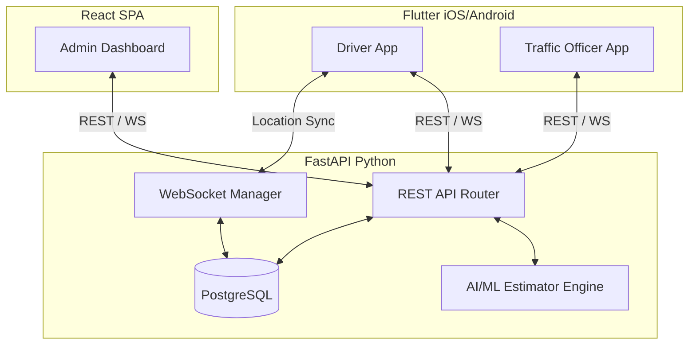

<div align="center">
  <h1>🚑 Emergency Route Coordinator (ERC)</h1>
  <p><strong>AI-Driven Traffic Ambulance Coordination System</strong></p>

  [](https://opensource.org/licenses/MIT)
  [](https://fastapi.tiangolo.com/)
  [](https://flutter.dev/)
  [](https://reactjs.org/)
  [](https://www.postgresql.org/)
</div>

---

A production-ready full-stack system designed to revolutionize emergency response. ERC coordinates ambulances through urban traffic during emergencies by leveraging real-time GPS tracking, OpenStreetMap (OSRM) route optimization, IoT traffic light simulation, and Predictive AI modeling.

## 📑 Table of Contents
- [✨ Features](#-features)
- [🏗 Architecture](#-architecture)
- [🛠 Tech Stack](#-tech-stack)
- [🚀 Quick Start (Local Setup)](#-quick-start-local-setup)
- [🧠 How the AI Works](#-how-the-ai-works)
- [📖 API Reference](#-api-reference)
- [🗺 Workflows](#-workflows)
- [🤝 Contributing](#-contributing)
- [📄 License](#-license)

---

## ✨ Features

- **Predictive AI ETA & Routing:** Utilizes gradient boosting and geometric estimation to predict response times based on traffic heuristics, time of day, and historical OSRM trip data.
- **Auto-Discovered Risk Hotspots:** Uses K-Means clustering on historical emergency data to auto-discover accident-prone zones and display them via predictive heatmaps on the dashboard.
- **Offline-First Synchronization:** The mobile app leverages `Hive` and `connectivity_plus` to queue API mutations (like starting/ending emergencies) if the network drops, automatically syncing when connectivity returns.
- **Real-Time WebSockets:** Live GPS ambulance tracking, traffic officer dispatch alerts, and active session monitoring synced across all platforms in milliseconds.
- **Advanced Admin Dashboard:** React/Vite-powered interface with dynamic Recharts trend tracking, Predictive Heatmaps (Leaflet), full Fleet Activity logs, and one-click CSV Data Exports.
- **Interactive Map Pinning:** Overridable AI destination estimation via OpenStreetMap draggable pin-drops with reverse geocoding on the mobile client.
- **RBAC Security:** Role-based access control with secure JWT authentication for Admins, Drivers, and Traffic Officers.

---

## 🏗 Architecture

The system operates across three primary environments connected via REST APIs and persistent WebSockets.



---

## 🛠 Tech Stack

| Layer | Technologies |
|-------|-------------|
| **Backend** | Python 3.12+, FastAPI, SQLAlchemy, Alembic, PostgreSQL, WebSockets, JWT, Scikit-Learn |
| **Mobile** | Dart, Flutter 3.16+, Provider, Dio, Hive (Offline), flutter_map, geolocator, go_router |
| **Dashboard** | TypeScript, React, Vite, Tailwind CSS, Recharts, React Leaflet, Axios |
| **Mapping / Routing** | OpenStreetMap (OSRM shortest-path), Nominatim (Geocoding) |

---

## 🚀 Quick Start (Local Setup)

### Prerequisites
- Python 3.12+
- PostgreSQL 16+ (or Docker installed)
- Node.js 18+
- Flutter 3.16+ (for mobile development)

### 1. Database & Backend
First, spin up the local PostgreSQL database using Docker:
```bash
docker compose up postgres -d
```
Next, initialize the Python backend:
```bash
cd backend
python -m venv venv

# Windows: venv\Scripts\activate
# macOS/Linux: source venv/bin/activate
# Fish Shell: source venv/bin/activate.fish

pip install -r requirements.txt
cp .env.example .env

# Run database migrations and seed default users
alembic upgrade head
python -m scripts.seed_data

# Start the API server
uvicorn app.main:app --reload --host 0.0.0.0 --port 8000
```
*API Documentation available at: [http://localhost:8000/docs](http://localhost:8000/docs)*

### 2. Admin Dashboard
In a new terminal window, initialize the React frontend:
```bash
cd dashboard
npm install
cp .env.example .env
npm run dev
```
*Dashboard available at: [http://localhost:5173](http://localhost:5173)*

### 3. Flutter Mobile
In a new terminal window, initialize the mobile application:
```bash
cd mobile
flutter pub get

# Run on iOS/Android Simulator (Use your machine IP for physical devices)
flutter run --dart-define=API_BASE_URL=http://127.0.0.1:8000
```

### Seed Credentials
| Role | Email | Password |
|------|-------|----------|
| **Admin** | `admin@ambulance.gov` | `Admin@12345` |
| **Driver** | `driver@ambulance.gov` | `Driver@12345` |
| **Officer** | `officer@ambulance.gov` | `Officer@12345` |

*(Note: Admins can dynamically create unlimited additional users via the React Dashboard).*

---

## 🧠 How the AI Works

### Incident Location Estimation (`hybrid-v1`)
A deterministic, hotspot-anchored estimator:
- Starts from the caller's position using a per-type reach profile (e.g., cardiac incidents require exact routing, fire routing is generalized).
- Attracts the estimate toward a curated table of risk hotspots (junctions, arterial roads) using inverse-square weighting modulated by rush hour logic.
- Confidence scores are geometric and clamped to `0.35–0.98`.

### Learned ETA Model (`eta-v1`)
Every completed emergency session records ground truth (OSRM baseline duration vs. actual wall-clock duration). 
- Once **≥25 trips** are completed, a gradient-boosting regressor learns each trip's `actual / baseline` ratio based on distance, hour, weekday, traffic factor, and incident type.
- New emergencies dynamically calculate ETA = `baseline × predicted ratio`.
- Persisted securely to `backend/models/eta_model.joblib`.

### Auto-Discovered Hotspots
When the system records **≥20 completed sessions**, K-Means clustering automatically identifies recurring accident zones and categorizes them by dominant incident type. These clusters dynamically append to the curated estimator table, ensuring the AI strictly tunes itself to observed urban reality.

---

## 📖 API Reference

### Emergency & Routing
- `POST /api/v1/emergencies/activate` - Start an emergency (triggers AI estimation and Officer WS notifications)
- `POST /api/v1/routes/optimize` - Generate OSRM route polygon and traffic score
- `GET /api/v1/directions/reverse-geocode` - Convert lat/lng to exact street address

### Analytics & AI
- `GET /api/v1/analytics/trend` - 7-day historical response time analysis
- `GET /api/v1/analytics/heatmap` - Predictive AI high-risk zone rendering dataset
- `POST /api/v1/ai/retrain-model` - (Admin only) Force retraining of the gradient boosting ETA model

*(See `http://localhost:8000/docs` for the complete Swagger UI documentation).*

---

## 🗺 Workflows

1. **Driver**: Logs in, selects an ambulance, and stands by. When an emergency is reported, the Driver hits "Activate Emergency". The AI estimates the location, calculates the ETA, and immediately broadcasts the active status to the network.
2. **Traffic Officer**: Receives a real-time WebSocket push notification on their mobile device alerting them to a nearby incoming ambulance, allowing them to clear intersections and manually trigger simulated IoT traffic lights.
3. **Admin**: Monitors the entire urban grid from the React Dashboard. Observes real-time fleet activity, tracks average response trends, exports CSV reports, and analyzes predictive heatmaps to better allocate standing ambulance positions.

---

## 🤝 Contributing

We welcome community contributions! 
1. Fork the Project
2. Create your Feature Branch (`git checkout -b feature/AmazingFeature`)
3. Commit your Changes (`git commit -m 'Add some AmazingFeature'`)
4. Push to the Branch (`git push origin feature/AmazingFeature`)
5. Open a Pull Request

---

## 📄 License

Distributed under the MIT License. See `LICENSE` for more information.
